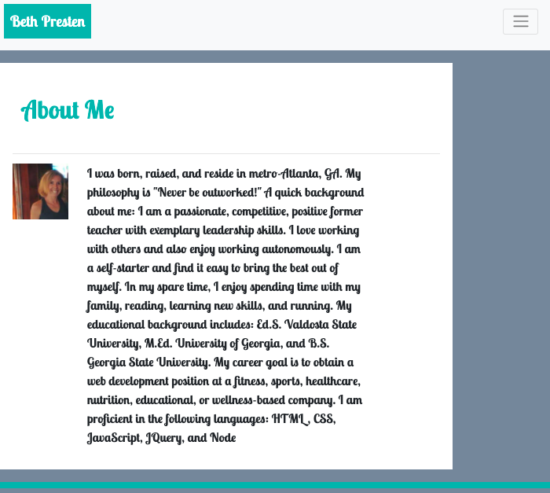
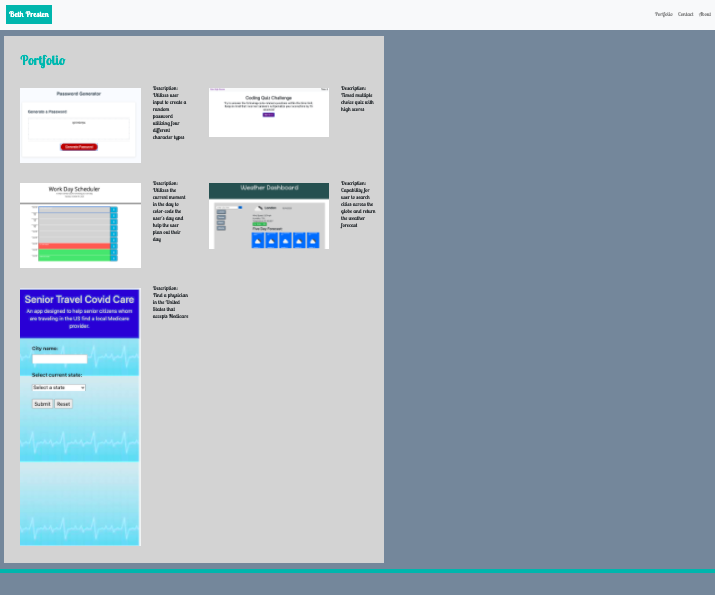

# HomeworkPortfolio

Description:
This application was modified from a former application. I created a skeleton portfolio based on the skills that I had at that point. This application is now fully descriptive and functioning with a full biography, personalized touches with fonts, screenshots of projects and assignments, and a functioning form.

Three separate html pages comprise the portfolio: an index/about, contact, and portfolio page.

Index.html: The index page is where general information can be found.

Portfolio.html: The portfolio page is where project information and brief descriptions can be found.

Contact.html: The contact is where a contact form as well as direct contact information can be found.

Screenshots:
Index: 
Portfolio: 
Contact: 

Github: [https://github.com/bethpresten]

Credits: Bootstrap, W3Schools, FontAwesome, and Google Fonts

License
MIT License

Copyright (c) [2020] [Beth Presten]
Permission is hereby granted, free of charge, to any person obtaining a copy of this software and associated documentation files (the "Software"), to deal in the Software without restriction, including without limitation the rights to use, copy, modify, merge, publish, distribute, sublicense, and/or sell copies of the Software, and to permit persons to whom the Software is furnished to do so, subject to the following conditions:

The above copyright notice and this permission notice shall be included in all copies or substantial portions of the Software.

THE SOFTWARE IS PROVIDED "AS IS", WITHOUT WARRANTY OF ANY KIND, EXPRESS OR IMPLIED, INCLUDING BUT NOT LIMITED TO THE WARRANTIES OF MERCHANTABILITY, FITNESS FOR A PARTICULAR PURPOSE AND NONINFRINGEMENT. IN NO EVENT SHALL THE AUTHORS OR COPYRIGHT HOLDERS BE LIABLE FOR ANY CLAIM, DAMAGES OR OTHER LIABILITY, WHETHER IN AN ACTION OF CONTRACT, TORT OR OTHERWISE, ARISING FROM, OUT OF OR IN CONNECTION WITH THE SOFTWARE OR THE USE OR OTHER DEALINGS IN THE SOFTWARE.
